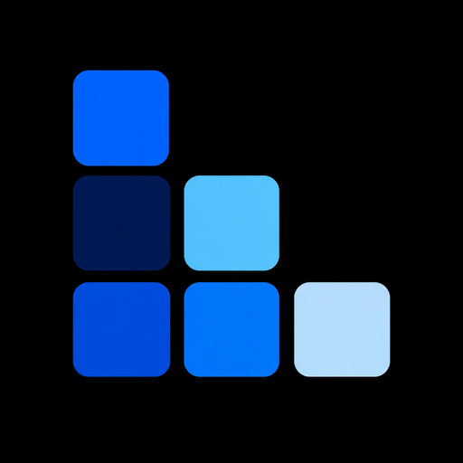

<p align="center">
  
</p>

<h1 align="center">Codans</h1>

<p align="center">
  <strong>Parallel development for the agent era.</strong><br />
  One Mac-native window. Many worktrees. Every agent.
</p>

<p align="center">
  <a href="https://codans.dev">Website</a> ·
  <a href="CHANGELOG.md">Changelog</a> ·
  <a href="https://github.com/wanggang316/codans/releases">Releases</a>
</p>

---

Codans is a terminal development environment built for parallel development with coding agents. It orchestrates all of your projects, worktrees, and coding agents into a single window.

## Highlights

| | |
|---|---|
| **Native** | Built on Ghostty and native to macOS. |
| **Agent-first** | See the live running state of every agent in real time. |
| **Parallel** | Project tree + git worktrees + tabs + split panes manage every line of work in one window. No more Cmd-Tab. |
| **Custom commands** | Bind project-specific commands and shortcuts; one chord runs the right thing. |
| **GitHub** | Deep GitHub integration — manage the whole pull-request lifecycle in-app. |
| **Keyboard-driven** | A deep set of customizable shortcuts to keep you fast. |
| **IDE integration** | VS Code, Cursor, Zed, and Xcode are auto-detected. One shortcut opens any worktree. |

## Install

```bash
brew install --cask wanggang316/tap/codans
```

The cask installs `Codans.app` into `/Applications` and symlinks the embedded `codans` CLI into Homebrew's `bin`. Subsequent updates flow through the in-app Sparkle updater; `brew upgrade --cask codans` also picks up new stable releases.

## Requirements

- macOS with Xcode **26.0+** (pinned via `apps/mac/Tuist.swift`)
- [`mise`](https://mise.jdx.dev/) for tool version pinning (`tuist`, `zig`, `swiftlint`, `xcbeautify`, `xcsift`)

## Quick Start

```bash
# One-time per worktree
mise trust . apps/mac
make bootstrap            # init submodules (ghostty, git-wt) + mise install

# Generate + build + run
make mac-generate         # tuist install + tuist generate (builds Ghostty xcframework)
make mac-build            # build Codans.app + codans CLI
make mac-run-app          # build + open the app
```

> First-time Ghostty build is ~3.9 GB / ~20 min. In additional worktrees, symlink the cache:
> `ln -s <main>/apps/mac/.build/ghostty apps/mac/.build/ghostty`

## Commands

| Command | Description |
|---|---|
| `make bootstrap` | Init submodules + `mise install` |
| `make mac-generate` | Generate `codans.xcworkspace` from Tuist |
| `make mac-build` | Build the Mac app + `codans` CLI |
| `make mac-run-app` | Build and launch `Codans.app` |
| `make mac-lint` | Run `swiftlint --quiet` |
| `make mac-check` | `swift-format` in-place + lint |
| `make mac-test` | Run test bundles (placeholder) |
| `make mac-release` | Archive → notarize → DMG → staple |
| `make help` | Full target list |

The top-level `Makefile` delegates every `mac-*` target to `apps/mac/Makefile`.

## Documentation

All project knowledge lives in [`docs/`](docs/):

- [Architecture](docs/architecture.md) — domains, layers, dependency rules
- [Product specs](docs/product-specs/) — what the product is
- [Design docs](docs/design-docs/) — feature and system designs

Agent-facing entry point: [`AGENTS.md`](AGENTS.md) (also exposed as `CLAUDE.md`).

## License

Codans is open source under the [MIT License](LICENSE).
