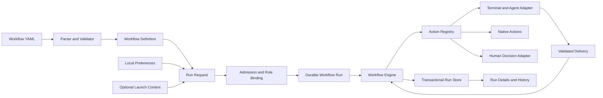

# 设计文档：Agent Workflows v2

**状态：** 设计提案，未实现。替代旧版的固定模板、全局 Workspace 绑定和创建运行表单设计。
**日期：** 2026-09-16

## 1. 核心决定

Workflow 是可复用的协作定义：由哪些参与者、按什么依赖、执行哪些动作、交付什么结果。Role 是定义中的参与者位置；Run 才把位置绑定到真实 Agent。定义不持有执行状态，不绑定具体 Workspace、Profile UUID、Pane 或 Session。

采用 Prowl 的 Role 与定义目录思路，保留前轮提出的类型化数据引用和 Action 注册机制。一个定义可以执行多次，每次独立绑定参与者、输入和运行环境。Handoff、Advisor、Committee 都是普通定义，Engine 不按它们的名称分支。

本轮只更新设计。现有固定串行实现的能力和限制仍以 [使用说明](../workflow-usage.md) 为准；本文件的 YAML、类型和命令均为目标契约。

## 2. Prowl 的依据与取舍

只读检查本地 Prowl checkout `74d9e3a4866f33364938aeabefa72ae4fda6e306`，未进行 Prowl GUI 或运行验证。

| 源码位置（相对 Prowl 根目录） | 实际机制 | Codans 采用方式 |
|---|---|---|
| `supacode/CLIService/Shared/WorkflowDefinition.swift` | Role 的 source 为 current、pick、launch；launch 声明运行时要求和 Profile 建议 | 保留 Role；要求、偏好和实际绑定分开 |
| `supacode/Domain/Workflow/WorkflowRun.swift` | current/pick 绑定 Pane；launch 先绑定 Profile，再取得 Pane | Run 保存绑定；启动是显式、有执行记录的副作用 |
| `supacode/Domain/Workflow/WorkflowBindingResolver.swift` | 根据运行参数和首选配置解析参与者 | 保存偏好只用于预填；每次运行重新校验 |
| `supacode/CLIService/Shared/WorkflowDiscovery.swift` | 内置、用户、仓库来源的 Workflow bundle 发现 | 区分定义来源与执行环境；冲突显式显示 |
| `supacode/Features/Settings/Views/WorkflowsSettingsView.swift`、`WorkflowSettingsDetailView.swift`；`supacode/Features/Workflow/Views/WorkflowStartOverlayView.swift`、`WorkflowStepHistoryDetailView.swift` | 定义目录、外部 YAML 编辑、运行设置、运行面板和历史分离 | 设置管理定义；终端附近启动和观察；全局查看历史 |
| `Resources/workflows/handoff.pwlworkflow/workflow.yaml` | author=current，receiver=launch；message、保存 Action、launch 组成交接 | 用 Handoff 验证通用机制；增加相关联的接收回执校验 |

不照搬的部分：Prowl 的运行上下文包含必需 worktree；Codans 的引擎不设此全局要求。终端启动所需的宿主、目录仍必须在运行时解析。Prowl 当前 Handoff 的接收 launch 未声明 expect，不能把该示例当成接收确认协议的证据。

## 3. 领域结构与所有权

| 实体 | 含义与主要字段 | 生命周期 |
|---|---|---|
| WorkflowDefinition | schema、id、name、description、inputs、roles、nodes、outputs | 可编辑、可分享的定义 |
| RoleDefinition | key、label、description、source、requirements | 属于定义，不保存真实参与者 |
| NodeDefinition | id、title、uses、role?、needs、with、expect?、policy? | 一次动作调用的声明 |
| ActionDescriptor | id、version、输入/输出 schema、Role 要求、副作用和恢复能力 | 注册、版本化的实现契约 |
| WorkflowPreferences | definition identity、enabled、Role 的首选 Profile、启动呈现偏好 | 本机偏好，不导出到定义 |
| RunRequest | definition identity、inputs、Role selections、可选启动上下文 | 校验后创建一次 Run |
| WorkflowRun | 冻结定义与 Action 版本、实际输入、绑定、状态、结果、时间 | 持久执行记录 |
| RoleBinding | role key、选定 Profile 快照或现有端点、bindingGeneration、绑定历史 | 属于 Run |
| NodeExecution | nodeID、状态、attempts、accepted output | 属于 Run |
| Attempt | attemptID、输入快照、bindingGeneration、派发状态、Delivery、错误、时间 | 重试新增，不覆盖 |
| Delivery / Artifact / Event | 显式交付、不可变内容、按序发生的事实 | 属于运行历史 |

WorkItem 可以表达外部业务目标并关联多个 Run，但不作为运行引擎的强制前置实体。交接流程成功不能自动完成其关联的业务任务。



UI、CLI 与 Skill 都访问同一个 Workflow Service。Skill 可以生成或修改 YAML，也可以发起运行；它不持有运行真相。Runtime 继续拥有终端生命周期，Engine 通过适配器取得可验证的执行端点。

## 4. Role：参与者位置、来源、绑定

保留 Role 作为一级实体，撤回上一轮将它弱化为可选别名的建议。对于终端协作，author、receiver、reviewer 比分散在节点中的 Session 引用更适合表达持续的参与者身份。

```typescript
type RoleSource = "current" | "pick" | "launch";

interface RoleDefinition {
  label: string;
  description?: string;
  source: RoleSource;
  requirements?: {
    capabilities?: string[];
    agents?: string[];
  };
}

type RoleSelection =
  | { source: "current"; endpoint: SessionEndpoint }
  | { source: "pick"; endpoint: SessionEndpoint }
  | { source: "launch"; profileId: string; environment: LaunchEnvironment };

interface SessionEndpoint {
  paneId: string;
  endpointGeneration: number;
  agentSessionId?: string;
}
```

- **current**：运行发起时固定的来源端点。来自某 Pane 的入口可预填；全局入口缺少来源时要求选择。之后切换焦点不改变绑定。
- **pick**：选择已有 Agent。候选可按当前环境优先排序，但 Engine 不要求所有参与者属于同一 Workspace。
- **launch**：运行准备阶段选择 Profile 与启动环境；执行 `session.launch` 节点时才创建真实终端和 Agent。填好 Profile 不等于已经启动。

`requirements` 是硬约束，只表达适配器能检查的能力，例如可投递消息和可提交关联回执；不声称能检查“擅长审查”。缺省不限制 Agent 品牌。用户明确指定但不满足要求的 Profile 必须报错，不能自动换成首选或推荐 Profile。职责说明是文本，只有节点明确引用它时才成为发给 Agent 的内容，避免隐藏提示注入。

Profile 决定启动什么 Agent、模型和启动选项；Role 决定它在本流程担任什么位置。Profile 建议可后续加入，不要求作者为了定义 reviewer 而选择 Claude Code 或某个本机 Profile。

同一 Role 默认在本次运行中持续复用同一个 Session。两个 Role 可以使用同一 Profile，但 launch 时生成不同 Session。第一版禁止两个可写交互 Role 同时绑定同一端点，也禁止多个 Run 同时向该端点投递消息。这是 Codans 调度租约，不是文件系统锁，也不能阻止用户手工输入或第三方程序操作；因此不能据此宣称取得仓库独占写权限。端点重启提升 endpointGeneration；重新绑定提升 RoleBinding.bindingGeneration 并追加历史。Attempt 固定这两种身份，旧回执不能完成新 Attempt。

Role 没有全局独立“角色库”，也不等于 Skill。Role 列表是每个 Workflow 定义的一部分；已有 Agent Profiles 仍由设置页统一管理。

### 运行环境不是 Workflow 的归属

`LaunchEnvironment` 保存宿主、cwd、必要的终端放置位置；由启动上下文预填并在运行前校验。Profile ID 和解析后的非敏感启动配置冻结到 Run，凭证只保存安全引用。

定义来源为仓库只影响发现与分享，不自动让仓库成为所有节点的 cwd。需要目录的 Action 显式声明路径输入或端点要求。无需终端、文件或仓库的流程可以完全没有 Workspace。全局启动 Handoff 时缺少来源或接收者启动目录，应在对应 Role 行补齐，不能重新加一个所有 Workflow 都必填的 Workspace 下拉框。

## 5. 节点、Action 与数据流

采用单层 nodes DAG。`needs` 是执行依赖，`with` 是输入来源，`uses` 是注册 Action 及版本。一个节点可以没有 Role，例如保存 Artifact 或等待用户决策。Role 字段用于指定动作操作哪个参与者，而不是携带任意 Session ID。

```yaml
review:
  title: Review the proposal
  uses: codans/agent.request@v1
  role: reviewer
  needs: [launch_reviewer, proposal]
  with:
    instruction:
      value: Review the proposal and report concrete risks.
    context:
      proposal:
        ref: nodes.proposal.outputs.result
  expect:
    format: markdown
    sections: [Findings, Recommendation]
```

`value` 是字面量，`ref` 是结构化引用，二者互斥。第一版不解释任意 JavaScript 或嵌入表达式。引用必须存在、类型兼容，并指向 needs 的传递上游。通过下标或转义访问复杂 JSON 的语法另行定义，首版限制标识符并支持命名字段路径。

`agent.request` 的输入 schema 固定为 instruction 与 context；context 是命名的类型化输入映射，不能把任意键加入 Action 顶层。适配器将解析后的 context 与 instruction 一起呈现给 Agent，Artifact 通过受控读取引用提供。其他 Action 拒绝 schema 未声明的输入。

`expect` 仅用于支持交付契约的 Action。`agent.request` 返回已接受的 `result` 和其 Delivery 引用；JSON expect.schema 同时决定 outputs.result 的静态类型，text/markdown 的 result 为字符串；Markdown 可校验指定标题，JSON 可校验 schema。格式正确不证明业务结论正确，后者由审查、领域校验 Action 或 Human 节点判断。

每个 launch Role 在首版定义中恰好有一个 `session.launch` 节点；current/pick 禁止 launch，未知 Role、重复启动、缺少 Action 必需 Role 字段均在运行前拒绝。`session.launch` 成功后记录端点绑定。同 Role 的后续消息必须依赖其启动节点。已有端点的身份变化或不可用产生明确等待原因；不静默新建替代 Session。

| 首版 Action | 输入 / 输出 | 完成依据 |
|---|---|---|
| `codans/session.launch@v1` | launch Role 的运行绑定 / SessionEndpoint | 端点创建且消息通道已就绪，不代表任务完成 |
| `codans/agent.request@v1` | Role、instruction、显式上下文、expect / result、Delivery | 对应 Attempt 的交付被校验且持久接受 |
| `codans/artifact.create@v1` | 内容、媒体类型 / ArtifactRef | 不可变内容和索引提交 |
| `codans/handoff.packet.create@v1` | briefing、显式上下文 / PacketRef | 领域验证通过且 packet 持久化 |
| `codans/handoff.ack.verify@v1` | PacketRef、acknowledgement / readiness | packet ID、digest 和必需字段匹配 |
| `codans/human.decide@v1` | 问题、选项、证据引用 / decision、reason | 用户提交被记录 |
| `codans/notify@v1` | 文本、结果引用 / notification reference | 通知已提交，不代表用户已阅读 |

Action 的逻辑版本、DSL schema 版本、定义内容 digest 分别记录。Run 固定实际实现版本；旧实现不可用时不能用新版本悄悄续跑。任意 shell 脚本 Action、循环和动态改图不进入首版。DAG 可表达独立分支，但首版调度可以串行；先验证端点占用与副作用边界，再增加并发。

## 6. Handoff 完整定义示例

以下是提案 DSL，并非当前应用可导入文件。示例的成功范围是材料交接和接收确认；不包含业务任务执行或写权限转移。

```yaml
schema: codans.workflow/v1
id: codans.handoff
name: Handoff
description: Prepare a packet and confirm that a receiver has understood it.

inputs:
  objective:
    type: string
    required: true

roles:
  author:
    label: Author
    source: current
  receiver:
    label: Receiver
    source: launch

nodes:
  briefing:
    title: Prepare briefing
    uses: codans/agent.request@v1
    role: author
    with:
      context:
        objective:
          ref: inputs.objective
      instruction:
        value: >-
          Summarize this conversation for handoff. Preserve user constraints,
          completed work, verification evidence and unresolved questions.
          Do not perform new task work. Submit the briefing through delivery.
    expect:
      format: markdown
      sections: [Objective, Current State, Completed Work, Next Steps]

  packet:
    title: Save immutable packet
    uses: codans/handoff.packet.create@v1
    needs: [briefing]
    with:
      briefing:
        ref: nodes.briefing.outputs.result

  launch_receiver:
    title: Start receiver
    uses: codans/session.launch@v1
    role: receiver
    needs: [packet]

  receive:
    title: Read and acknowledge
    uses: codans/agent.request@v1
    role: receiver
    needs: [packet, launch_receiver]
    with:
      context:
        packet:
          ref: nodes.packet.outputs.packet
      instruction:
        value: >-
          Read the complete packet. Return its ID and digest, your understanding,
          a concrete next action and blockers. Do not execute the task yet.
    expect:
      format: json
      schema:
        type: object
        required: [packetId, packetDigest, understanding, nextAction, blockers]
        additionalProperties: false
        properties:
          packetId: {type: string, minLength: 1}
          packetDigest: {type: string, minLength: 1}
          understanding: {type: string, minLength: 1}
          nextAction: {type: string, minLength: 1}
          blockers:
            type: array
            items: {type: string}

  verify:
    title: Verify acknowledgement
    uses: codans/handoff.ack.verify@v1
    needs: [packet, receive]
    with:
      packet:
        ref: nodes.packet.outputs.packet
      acknowledgement:
        ref: nodes.receive.outputs.result

outputs:
  packet:
    ref: nodes.packet.outputs.packet
  acknowledgement:
    ref: nodes.receive.outputs.result
  readiness:
    ref: nodes.verify.outputs.readiness
```

执行前 author 绑定来源 Pane 的 endpointGeneration，receiver 绑定所选 Profile 和启动环境。执行 briefing 后保存 Delivery；packet Action 返回不可变的 `{id, digest, artifact}`，不使用可被下一次交接覆盖的 current 文件作为权威输入。保存成功后才启动接收者，然后发送 packet 读取引用及本次交付凭据。

ArtifactRef 是受控资源引用，不仅是裸路径；读取会校验 Run、Attempt 与授权输入。终端启动与消息投递属于两个独立可观察阶段。receive 的 schema 验证结构；verify 比较 ID/digest 等跨输入事实。存在 blockers 时结果为 blocked，界面显示“已确认接收，存在阻碍”；执行成功与 ready 是两个维度。

source Agent 从 CLI 发起流程时若已提供 briefing，运行独立 `codans.handoff-from-briefing` 定义：briefing 为必填输入，首节点直接保存 packet，随后启动和确认接收。它不再向来源 Agent 请求整理，避免同步等待自己再次回答。GUI 需要代为请求整理时使用上面的 `codans.handoff`。两份定义共享 Action 和契约测试，首版不因此引入子流程或可选输入分支。GUI 对来源 Agent 请求整理材料时，也必须等待可投递状态并让其完成当前轮，不能任意打断或猜测已经接受请求。

现有 Handoff 的“保存”和“交接后继续”入口最终由此基础组合：保存变体只执行材料节点；继续变体另加旧执行者停止/释放、明确的继续授权和执行节点。接收确认不隐式赋予新写权限，也不暗示旧 Agent 已停止。

## 7. 前端页面与管理方式

本轮确定信息架构，不做品牌或视觉风格改造。沿用原生 macOS 设置、分栏列表、文本预览、系统颜色与键盘操作。没有另建图形编辑器的前置要求。

### 定义管理：Settings → Agents → Workflows

左侧是可搜索定义列表，显示名称、来源、启用状态、验证错误；右侧是所选定义的详情。新增按钮含 New Workflow、Import、Duplicate Selected。New Workflow 以 id、名称创建最小有效结构的草稿并进入详情；输入、角色和节点通过 Open in Editor 修改 YAML，应用同步预览与诊断。不出现选择另一个 Workflow 的字段，也不执行 Run。

详情分为 Overview、Source、Runs：

- **Overview**：用途、输入契约、Role 来源与要求、节点顺序/依赖的只读投影；Run、Duplicate、Reveal in Finder；运行偏好单独区域，标明仅本机。
- **Source**：完整 YAML、实际绝对路径、来源、验证行列、Copy、Open in Editor、Reload。首版采用外部编辑器，应用内只读高亮预览；不把路径入口当作唯一查看方式。
- **Runs**：当前定义的运行记录，进入通用 Run 详情。查看历史中的定义时显示冻结版本，可以与当前源码不同。

内置定义只读，编辑动作是复制为新 ID 的用户定义。用户定义可编辑。无效文件保留在列表并显示错误，不能运行。第一版同 ID 冲突阻止运行并列出冲突来源，避免隐式覆盖难以追踪。

### 发起运行：终端、命令面板、定义详情

菜单明确区分 New Workflow、Run Workflow、Show Workflow Runs。由“Run Workflow”入口选择定义是合理的；进入某个定义后运行，表单标题就是该定义名称，不再有 Workflow 类型下拉框。

Run 设置只渲染该定义需要的输入与 Role：current 为来源端点，pick 为已有 Agent，launch 为 Profile 和必要的启动环境。沿用原生紧凑表单。字段由 schema 生成，不为 Advisor/Committee 写专门组件分支。

首选 Profile 可以记住，但失效时显示原因并重新选择。默认显示运行设置；用户启用快速运行且输入/绑定完整有效时才省略。全局入口缺少上下文不隐式采用上一次 Workspace。

### 运行观察：终端附近状态 + 全局历史

终端附近显示当前参与运行、Role、执行节点和等待原因，点击进入运行详情。状态能导航到仍存在的 Agent；端点已关闭则保留历史身份并显示不可用。

全局运行历史独立于 Workspace，支持 All、Active、Needs Attention 和按定义筛选；可选按参与 Pane 或环境过滤，环境被删除也能查看历史。左侧运行列表，右侧固定详情，不因完成切换选中项。

详情以节点列表和选中节点内容为主体；可提供从定义投影的只读依赖图。节点显示输入、已解析引用、Role/Profile/Session、Attempt 时间线、交付结果、校验错误和恢复操作。YAML 视图显示本次冻结定义。

错误操作由 Engine 返回的 allowed operations 渲染。等待交付可 Open Agent / Keep Waiting / Cancel；未知启动结果先定位端点与核查副作用，不能始终展示一键 Retry。人工代交付标明来源，不能显示为 Agent 的自动交付。

## 8. 定义文件与运行持久化

定义采用 bundle，主文件为 workflow.yaml，可带相对路径的 prompt 和 schema 资源。内置在应用资源中，个人定义位于用户配置目录，仓库定义可位于 `.codans/workflows/`。具体用户目录由现有 channel-aware Settings 路径提供器派生，不能让 Debug 与 Release 共写。

UI 管理的是文件目录索引，不是另一份隐藏数据库定义。文件变动触发解析和验证；外部修改失败或内容无效不得无提示沿用旧定义。运行前对所选有效修订重新核对并冻结 bundle。源码字节和语义 digest 分开保存，资源内容参与语义版本，编辑器布局不参与。

```text
workflows/
  definitions/
    my-handoff.codansworkflow/
      workflow.yaml
      prompts/
      schemas/
  preferences.json
  v2/
    artifacts/<run-id>/
      run.json
      workflow.yaml
      events.jsonl
      <packet-id>.md
      nodes/<execution-id>/
        execution.json
        inputs.json
        outputs.json
        request.json
        instruction.md
        submissions/<submission-record-id>.json
```

运行存储采用纯文件方案，不使用数据库，不保留数据库兼容层，也不读取或迁移旧 SQLite 运行记录。`WorkflowRunStoreV2` 以存储根目录下 `artifacts/<run-id>/run.json` 为唯一权威记录；其中内联保存 Run 状态、Role 绑定、输入、节点执行、请求全文、每次提交正文与校验结果、输出及事件。

每次更新先原子替换完整 `run.json`，提交成功后再刷新同目录下的 YAML、事件、节点执行和请求/提交等派生文件。正文已经包含在权威快照中，恢复不依赖派生文件是否存在；先提交快照也避免派生文件超前于已提交状态。单个文件原子替换不等于整个目录的事务，崩溃后派生文件可能落后，启动时从 `run.json` 读取并修复。派生文件用于检查，不作为独立恢复源。承诺断电持久性前仍需单独验证文件同步策略，不能把原子替换等同于断电持久性。

每次副作用先记录 intent，执行后记录 outcome。UI 从事件驱动的投影读取，不把终端输出解析为执行事实。Agent 的内部工具调用只有显式上报后才能展示为结构化事件，不能把终端截图称为完整 Trace。

重试生成新 Attempt；超时进入明确等待原因，未知外部结果不得自动重放。取消先停止调度和接受结果，再处理端点资源；取消不等于终止 Agent 或撤销文件变更。重启将未结束运行标为 interrupted，保留完整材料，首版不自动恢复副作用。

历史删除、定义删除、关闭 Pane 是三种不同操作。删除定义不删除 Run，结束 Run 不关闭参与者；仅显式生命周期操作可以关闭由 Run 创建的端点。日志不落入工作仓库。留存和导出另设设置，不把 Artifact 暂存路径当作永久共享链接。

## 9. 对现有实现的替换范围

| 模块 | 调整方向 |
|---|---|
| `AgentWorkflowTemplate.swift` | 移除作为引擎核心的场景枚举；内置场景变成 YAML bundle |
| `AgentWorkflowRun.swift` | 保留显式交付、Attempt、取消等不变量，迁移为定义驱动的节点执行模型 |
| `AgentWorkflowRunner.swift` | 从场景分支调度改为依赖调度、Role binding 与 Action registry |
| `AgentWorkflowStore.swift` | 保留单写者/先存储再确认原则；替换为权威 JSON 快照与派生执行文件 |
| `WorkflowComposerView.swift` | 拆为定义创建入口和 schema 驱动的 Run 设置，不保留固定场景表单 |
| `WorkflowRunsView.swift` | 聚焦运行列表与详情；定义目录放入设置 |
| `HandoffHandlers.swift` | 变为定义调用适配器，packet 等领域逻辑放入对应 Action |
| IPC / CLI | 区分定义 list/show/validate/create 与 run/start/status/deliver/cancel；不提供旧运行格式兼容路由 |

产品尚未上线，不实现旧运行格式展示、旧版本解释器或数据库兼容层。新的文件存储只加载当前 DSL 格式的 `run.json`；不扫描旧数据库，不自动迁移或重新调度旧运行。

## 10. 构建顺序与验收

具体定义与合成运行材料见 [五个 Workflow v2 case](../examples/workflows-v2/README.md)：Handoff、已有 briefing 的 Handoff、Advisor、Committee、无 Role 的人工决策。每份包含 YAML 和独立 scenario.json；可执行检查器验证限定的契约与数据流，不代表应用已支持该 DSL 或真实 Agent 已执行。

1. **定义与 Role 契约**：解析、诊断、schema、Action registry 和 Handoff bundle。验证不包含本机 UUID、Role source 约束、重复 ID、未知 Action、循环依赖、非法引用与输出契约。
2. **定义管理**：新增、导入、复制、完整 Source 预览和外部编辑刷新；完全不启动 Agent 即可完成一次定义创建。
3. **运行基础**：RunRequest、绑定快照、事务存储、通用调度、显式 Delivery；验证 generation fencing、重复/迟到交付、崩溃窗口与取消期间投递。
4. **Handoff 贯通**：GUI/CLI 共用 Workflow Service，按是否已有 briefing 选择对应定义；packet 不可变，digest 错误不成功，接收未确认不完成，保存变体可独立结束。
5. **复用用例**：Advisor 的建议 + 人工决策；Committee 的两个分析、两个交叉审查、综合。新增定义不得修改 Engine 或新增场景表单。

必须覆盖的产品验收：同一份定义在两次运行绑定不同参与者；没有 Workspace 的纯数据流程可运行；需要 cwd 时只在具体资源处收集；历史不依赖端点仍存活；每个失败能看到原始输入、版本、Attempt 和可采取的操作；新建定义、查看 YAML、运行现有定义三个入口不再混淆。
