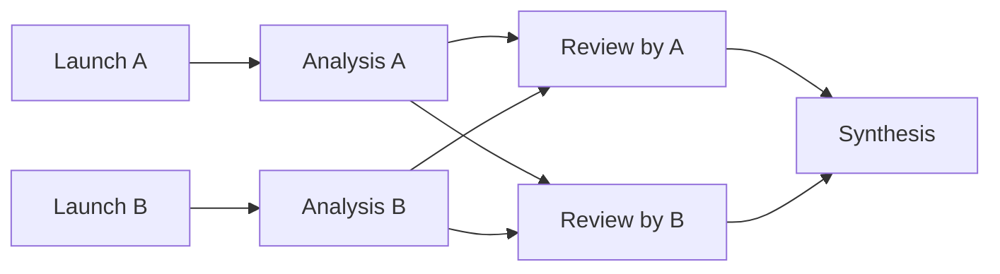

# Workflow v2 cases

Status: executable fixture checks for the proposed DSL, not installed workflows.
The current Codans application cannot import or execute these definitions yet.
Every `scenario.json` contains synthetic participants, supplied Action results and
expected workflow outputs. No fixture is an actual Agent report or user decision.

These cases exercise the [v2 design](../../design-docs/agent-workflows-v2.md)
before replacing the application's fixed templates. The definitions contain no
concrete Profile, Pane, Session or Workspace identity. Run selections live in
separate scenario files.

## Case inventory

| Case | Question exercised | Roles | Nodes |
|---|---|---|---|
| [Handoff](handoff.codansworkflow/workflow.yaml) | Can an existing author brief a new receiver and obtain a correlated acknowledgement? | author=current, receiver=launch | 5 |
| [Handoff from Briefing](handoff-from-briefing.codansworkflow/workflow.yaml) | Can a calling Agent hand over an existing briefing without asking itself another question? | receiver=launch | 4 |
| [Advisor](advisor.codansworkflow/workflow.yaml) | Can an existing Agent advise while the user retains the decision? | advisor=pick | 2 |
| [Committee](committee.codansworkflow/workflow.yaml) | Can independent analyses be exchanged and synthesized without losing disagreements? | analyst_a=launch, analyst_b=launch, synthesizer=pick | 7 |
| [Decision Only](decision-only.codansworkflow/workflow.yaml) | Can a workflow have no Agent, Session, Profile or Workspace? | none | 1 |

## 1. Handoff

```text
current author
  -> briefing
  -> packet
  -> launch_receiver
  -> receive
  -> verify
  -> packet + acknowledgement + readiness
```

Concrete input: review how invalid YAML remains visible in the definition editor,
without implementing changes. The author submits a briefing with Objective,
Current State, Completed Work and Next Steps. A packet references the immutable
briefing. The receiver reads it and returns its packet ID/digest, understanding,
next action and blockers.

The launch result is a Session endpoint. It cannot stand in for the receiver's
Delivery. JSON shape validation checks the acknowledgement fields; verification
checks that its ID and digest identify the supplied packet. A complete
acknowledgement with blockers returns `blocked`, not `ready`.

The definition has no launch directory. The synthetic run selection supplies
`receiver.environment.cwd` and a Profile ID. Those values are illustrative and
are not looked up or created by the checker.

Expected product view: five nodes; author and receiver identities; packet content;
receiver acknowledgement; readiness. Missing acknowledgement should remain a
waiting condition in the eventual runtime, rather than a successful handoff.
The fixture checker rejects an incomplete supplied trace; it does not implement
that runtime waiting state.

## 2. Handoff from Briefing

```text
briefing input -> packet -> launch_receiver -> receive -> verify
```

This variant has no author Role and no source-message node. Its input contains the
same complete briefing, allowing the current Agent to submit existing material
and return control. It uses exactly the same registered Actions as Handoff.

Expected product view: a briefing input and one receiver binding. No author
selector, no objective field and no workflow-wide Workspace selector. No hidden
branch skips a source request; the simpler graph explicitly omits it.

Both Handoff cases stop at acknowledged material transfer. Continuing task work,
releasing a previous writer and authorizing a new writer remain separate steps.

## 3. Advisor

```text
question -> advice(existing advisor) -> decision(human) -> advice + decision + reason
```

Concrete question: should a workflow advance after terminal idleness or require
an explicit Delivery? The synthetic report explains why idleness is only a
presentation hint and recommends accepted, correlated Delivery as the completion
boundary. The supplied human result adopts that recommendation with a reason.

`advisor` uses `source: pick`; it does not require a Profile or launch node.
The Human node references the accepted report as evidence. Its options are
`adopt`, `request_changes` and `reject`.

Expected product view: choose an existing advisor, enter the question, inspect
the report, then record a decision. `request_changes` is an outcome only: this
acyclic definition does not automatically perform a follow-up round.

## 4. Committee



Concrete question: should durable workflow metadata use SQLite or per-run JSON?
Analyst A supports SQLite transaction boundaries. Analyst B initially favors JSON
for inspectability and migration simplicity. Each initial analysis receives only
the same question, through a new Session. Both reviews wait for both accepted
analyses and then receive both reports.

Each analyst reuses its Session for review. An existing synthesizer receives both
analyses and both reviews. Its report recommends a storage boundary while keeping
unresolved filesystem durability and migration questions visible. Agreement is
not manufactured as a success condition.

Expected product view: two launch Profile selections and one existing synthesizer
selection. Seven node executions expose all five reports. The fixture traces use
a deterministic serial order; the graph does not imply that the application now
supports parallel execution. Context-key checks establish only the explicit data
passed by this definition, not sandbox isolation or independent model reasoning.

## 5. Decision Only

```text
proposal input -> decision(human) -> decision + reason
```

Concrete proposal: separate definition management from run creation and expose
YAML source. The user can adopt, request changes or reject it.

The definition has no Role declaration. The scenario has an empty Role selection
map and no environment. Expected product view: proposal and decision controls
only. This is the minimum counterexample to requiring Workspace or Session on
all workflows.

## Reproduce the checks

Requires Python 3.10+ and PyYAML. The dependency is pinned in
[requirements.txt](requirements.txt). Use an existing environment with that
dependency, or an isolated virtual environment:

```bash
python3 -m venv /tmp/codans-workflow-case-venv
/tmp/codans-workflow-case-venv/bin/python -m pip install -r docs/examples/workflows-v2/requirements.txt
/tmp/codans-workflow-case-venv/bin/python docs/examples/workflows-v2/check_cases.py --trace-dir /tmp/codans-workflow-v2-case-traces
```

The checker validates the supported fixture subset: duplicate YAML keys, Action
input/output names, Role launch dependencies, dependency cycles, upstream
references, scenario inputs and selections, Markdown headings, the JSON Schema
keywords used here, explicit Delivery presence, packet correlation, decision
options and workflow output equality. It also checks Committee's explicit initial
context and Session reuse.

Nine deliberately invalid Handoff variants must fail: unknown Action, cycle,
missing launch dependency, non-upstream reference, wrong Role source, wrong
packet digest, missing Delivery, launch without a receive result, and malformed
JSON acknowledgement. A valid acknowledgement with blockers must produce blocked
readiness.

The checker walks dependencies and resolves inputs against supplied results.
Optional JSON traces show exactly those resolved inputs, synthetic endpoints and
fixture outputs. They are labeled `synthetic-fixture-trace` and have no invented
execution times, real Run IDs or claims of accepted runtime events.

This is not a production parser, general JSON Schema implementation, scheduler or
Agent emulator. It does not validate credentials, Profile availability, process
readiness, retries, storage durability, real terminal isolation or crash recovery.
Delivery fixtures only check a nonempty ID, not Run/Attempt identity, generation
fencing or duplicate/late submission rejection. The fixture's packet digest hashes briefing text for a reproducible correlation
check; it does not define the production packet canonicalization algorithm.

## Acceptance sequence

1. Keep these definitions and synthetic scenarios reviewable as the DSL evolves.
2. Implement the production parser and Action contracts against the same cases.
3. Replace supplied results with injected Action adapters in application tests.
4. Run actual Handoff, Advisor and Committee sessions through the application and
   check persisted Attempts, Deliveries, Artifacts and recovery behavior.

Only step 1 has been exercised here. No terminals or Agents were launched and no
human decision was submitted.
